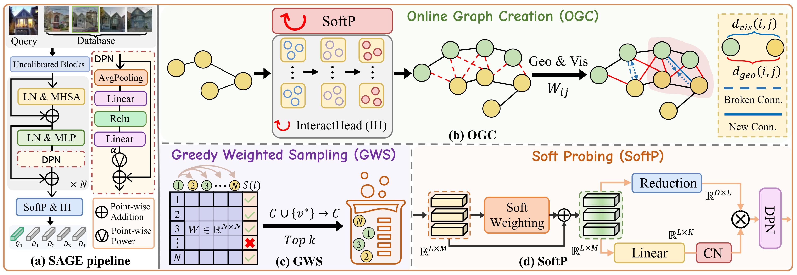

# SAGE

This is the official repository for the ICLR 2026 paper "SAGE: Spatial-visual Adaptive Graph Exploration for Efficient Visual Place Recognition".

[[ICLR OpenAccess](https://openreview.net/forum?id=DCpbEXqPvS)] [[ArXiv](https://arxiv.org/abs/2509.25723)] [[BibTex](https://github.com/chenshunpeng/SAGE?tab=readme-ov-file#Citation)]



## Summary

To address the limitations of static sampling policies, SAGE introduces a dynamic, "slow thinking" training paradigm that continuously reconstructs an online geo-visual graph during training. This architecture ensures the sampling strategy stays synchronized with the model's evolving embedding space, allowing a greedy weighted clique expansion sampler to iteratively mine the most challenging and informative spatial-visual neighborhoods. To further enhance feature representation without heavy overhead, SAGE incorporates a lightweight Soft Probing (SoftP) module that utilizes data-driven residual weighting to amplify discriminative local patches before aggregation. By applying parameter-efficient fine-tuning on a frozen DINOv2 backbone, SAGE achieves SOTA across eight VPR benchmarks, delivering exceptional robustness and parameter efficiency for large-scale geo-localization.

## Getting Started

This repo follows the [Visual Geo-localization Benchmark](https://github.com/gmberton/deep-visual-geo-localization-benchmark). You can refer to it ([VPR-datasets-downloader](https://github.com/gmberton/VPR-datasets-downloader)) to prepare datasets. The dataset should be organized in a directory tree as such:

```
├── datasets_vg
    └── datasets
        └── pitts30k
            └── images
                ├── train
                │   ├── database
                │   └── queries
                ├── val
                │   ├── database
                │   └── queries
                └── test
                    ├── database
                    └── queries
```

## Setup & Requirements
**Quick install:**
```bash
# create and activate conda env
conda create -n sage python=3.10.15 -y
conda activate sage

# install dependencies
pip install -r requirements.txt
```
**Key dependencies:**
```
faiss-gpu==1.7.2
numpy==1.26.4
pytorch-metric-learning==2.3.0
scikit-learn==1.5.2
timm==1.0.15
torch==2.1.0
torchvision==0.16.0
xformers==0.0.22
```
> **Note — reproducibility:** Feature extraction and retrieval are sensitive to minor numerical differences across versions of libraries like `faiss-gpu`, `torch`, and `numpy`. Please use the exact versions in [requirements.txt](https://github.com/chenshunpeng/SAGE/blob/main/requirements.txt) to match our paper's results.

## Test

**To evaluate the trained model:**

```
python3 eval.py --eval_datasets_folder=/path/to/datasets --crossimage_encoder --ckpt_path=/weights/SAGE.pth
```
Note: By default, `--eval_dataset_names` will sequentially evaluate on 8 datasets (sped, amstertime, msls, pitts30k, tokyo247, pitts250k, nordland, eynsham). You can modify this argument according to your specific dataset names.

**To add PCA:**

```
python3 eval.py --eval_datasets_folder=/path/to/datasets --crossimage_encoder --ckpt_path=./weights/SAGE.pth --pca_dim=4096 --pca_dataset_folder=/path/to/datasets/msls/images/train
```
Note: For PCA computation, the script prioritizes loading a local cache. If absent, it extracts up to $2^{14}$ samples to compute high-dimensional features in batches, fits Sklearn, and saves the PCA parameters.

**SAGE without cross-image encoder:**

Remove parameter `--crossimage_encoder` to run the SAGE without cross-image encoder.

## Trained Model

**🔥 Performance Edition.**
Equipped with the InteractHead module to model cross-image dependencies, achieving maximum retrieval accuracy.

<table style="margin: auto; text-align: center;">
  <thead>
    <tr>
      <th align="center">model</th>
      <th align="center">cross-image<br/>encoder</th>
      <th align="center">total params</th>
      <th align="center">trainable params</th>
      <th align="center">download</th>
    </tr>
  </thead>
  <tbody>
    <tr>
      <td align="center">SAGE</td>
      <td align="center">:white_check_mark:</td>
      <td align="center">314.74 M</td>
         <td align="center">$\color{red}{\mathbf{10.38\ M}}$</td>
      <td align="center">
        <a href="https://drive.google.com/file/d/1oybKqxFYIHYwoA9HuG7tlaCif7DcJsd4/view?usp=sharing">link</a>
      </td>
    </tr>
  </tbody>
</table>
<br>

**Results at 322×322 (with cross-image encoder)**
<table style="width:100%; border-collapse: collapse; font-size: 12px;">
    <thead>
        <tr>
            <th style="text-align:left;">Dataset</th>
            <th>R@1</th><th>R@5</th><th>R@10</th>
            <th style="text-align:left;">Dataset</th>
            <th>R@1</th><th>R@5</th><th>R@10</th>
        </tr>
    </thead>
    <tbody>
        <tr><td>Pitts30k-test</td><td>95.8</td><td>97.8</td><td>98.4</td><td>MSLS-val</td><td>94.5</td><td>97.4</td><td>97.8</td></tr>
        <tr><td>Nordland**</td><td>96.0</td><td>98.9</td><td>99.4</td><td>Tokyo24/7</td><td>97.5</td><td>99.0</td><td>99.4</td></tr>
        <tr><td>SPED</td><td>98.8</td><td>99.7</td><td>100.0</td><td>Pitts250k-test</td><td>98.4</td><td>99.4</td><td>99.6</td></tr>
        <tr><td>Eynsham</td><td>93.1</td><td>96.2</td><td>97.0</td><td>AmsterTime</td><td>83.5</td><td>93.3</td><td>95.4</td></tr>
    </tbody>
</table>

For Nordland variants: `Nordland*` uses 2,760 summer queries against a 27,592-image winter database, while `Nordland**` uses the full 27,592 winter queries against a 27,592-image summer database.

---

**⚡ Efficiency Edition.**
Streamlined for high inference efficiency, maintaining extremely low trainable parameters via Parameter-Efficient Fine-Tuning (PEFT).

<table style="margin: auto; text-align: center;">
  <thead>
    <tr>
      <th align="center">model</th>
      <th align="center">cross-image<br/>encoder</th>
      <th align="center">total params</th>
      <th align="center">trainable params</th>
      <th align="center">download</th>
    </tr>
  </thead>
  <tbody>
    <tr>
      <td align="center">SAGE (ViT-B)</td>
      <td align="center">:x:</td>
      <td align="center">88.54 M</td>
         <td align="center">$\color{red}{\mathbf{1.96\ M}}$</td>
      <td align="center">
        <a href="https://drive.google.com/file/d/1P4NrddzJ9nWo9Wdan3uDi6zS6E-ub2y6/view?usp=sharing">link</a>
      </td>
    </tr>
    <tr>
      <td align="center">SAGE (ViT-L)</td>
      <td align="center">:x:</td>
      <td align="center">306.86 M</td>
         <td align="center">$\color{red}{\mathbf{2.50\ M}}$</td>
      <td align="center">
        <a href="https://drive.google.com/file/d/1dML3VyYBixH4ZzNfoJavhKbS1b7hvif9/view?usp=sharing">link</a>
      </td>
    </tr>
  </tbody>
</table>

**Results at 322×322 (without cross-image encoder)**
<table style="width:100%; border-collapse: collapse; font-size: 12px;">
    <thead>
        <tr>
            <th rowspan="2" style="text-align:left;">Dataset</th>
            <th colspan="3"> <a href="https://drive.google.com/file/d/1P4NrddzJ9nWo9Wdan3uDi6zS6E-ub2y6/view?usp=sharing">ViT-B</a> </th>
            <th colspan="3"> <a href="https://drive.google.com/file/d/1dML3VyYBixH4ZzNfoJavhKbS1b7hvif9/view?usp=sharing">ViT-L</a> </th>
        </tr>
        <tr>
            <th>R@1</th><th>R@5</th><th>R@10</th>
            <th>R@1</th><th>R@5</th><th>R@10</th>
        </tr>
    </thead>
    <tbody>
        <tr><td>Pitts30k-test</td><td>93.4</td><td>97.0</td><td>97.9</td><td>94.7</td><td>97.7</td><td>98.4</td></tr>
        <tr><td>MSLS-val</td><td>93.4</td><td>97.3</td><td>97.6</td><td>94.2</td><td>97.8</td><td>98.1</td></tr>
        <tr><td>Nordland**</td><td>94.1</td><td>98.0</td><td>98.8</td><td>94.8</td><td>98.2</td><td>98.9</td></tr>
        <tr><td>Tokyo24/7</td><td>97.1</td><td>98.4</td><td>99.0</td><td>98.1</td><td>98.1</td><td>98.7</td></tr>
        <tr><td>SPED</td><td>91.8</td><td>95.7</td><td>96.5</td><td>92.1</td><td>96.2</td><td>96.9</td></tr>
        <tr><td>Pitts250k-test</td><td>95.7</td><td>98.6</td><td>99.2</td><td>96.9</td><td>99.2</td><td>99.6</td></tr>
        <tr><td>Nordland*</td><td>86.7</td><td>95.9</td><td>97.0</td><td>87.4</td><td>96.2</td><td>97.5</td></tr>
        <tr><td>Eynsham</td><td>92.3</td><td>95.8</td><td>96.5</td><td>92.3</td><td>95.9</td><td>96.7</td></tr>
        <tr><td>SF-XL-Small</td><td>88.8</td><td>90.5</td><td>90.9</td><td>89.0</td><td>91.8</td><td>92.2</td></tr>
        <tr><td>AmsterTime</td><td>63.1</td><td>82.5</td><td>86.2</td><td>65.6</td><td>86.7</td><td>90.4</td></tr>
    </tbody>
</table>

Or you can download **all models** at once at [this link](https://drive.google.com/drive/folders/1-nQi9fhJPuiqHkcrGqBoIwiemnQ2L1-m?usp=sharing).

## To-do
- [x] Public release of evaluation code and pretrained SAGE model.
- [ ] Public release of the training code (coming soon).
- [ ] More detailed documentation (coming soon).

## Related Work
Our another AAAI 2025 work (two-stage VPR based on DINOv2) [FoL](https://arxiv.org/abs/2504.09881) achieved SOTA performance on several datasets. The code is released at [here](https://github.com/chenshunpeng/FoL).

## Acknowledgements
Parts of this repo are inspired by the following repositories:
- [SuperVLAD](https://github.com/Lu-Feng/SuperVLAD), [CricaVPR](https://github.com/Lu-Feng/CricaVPR)
- [CliqueMining](https://github.com/serizba/cliquemining), [SALAD](https://github.com/serizba/salad)
- [Visual Geo-localization benchmark](https://github.com/gmberton/deep-visual-geo-localization-benchmark), [VPR-datasets-downloader](https://github.com/gmberton/VPR-datasets-downloader)
- [GSV-Cities](https://github.com/amaralibey/gsv-cities), [MixVPR](https://github.com/amaralibey/MixVPR)

## Citation
If you find this repo useful for your research, please consider leaving a star⭐️ and citing the paper.
```
@inproceedings{SAGE,
    title={{SAGE}: Spatial-visual Adaptive Graph Exploration for Efficient Visual Place Recognition},
    author={Shunpeng Chen and Changwei Wang and Rongtao Xu and Xingtian Pei and Yukun Song and Jinzhou Lin and Wenhao Xu and Jingyi Zhang and Li Guo and Shibiao Xu},
    booktitle={The Fourteenth International Conference on Learning Representations},
    year={2026},
    url={https://openreview.net/forum?id=DCpbEXqPvS}
}
```
