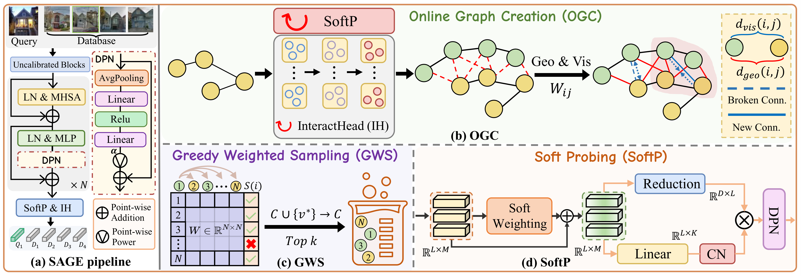

# SAGE

This is the official repository for the ICLR 2026 paper "SAGE: Spatial-visual Adaptive Graph Exploration for Efficient Visual Place Recognition".

<p align="center">
  <a href="https://chenshunpeng.github.io/projects/SAGE/"></a>
  <a href="https://openreview.net/forum?id=DCpbEXqPvS"></a>
  <a href="https://arxiv.org/abs/2509.25723"></a>
  <a href="https://iclr.cc/virtual/2026/poster/10010801"></a>
  <a href="https://github.com/chenshunpeng/SAGE"></a>
</p>



## Summary

To address the limitations of static sampling policies, SAGE introduces a dynamic, "slow thinking" training paradigm that continuously reconstructs an online geo-visual graph during training. This architecture ensures the sampling strategy stays synchronized with the model's evolving embedding space, allowing a greedy weighted clique expansion sampler to iteratively mine the most challenging and informative spatial-visual neighborhoods. To further enhance feature representation without heavy overhead, SAGE incorporates a lightweight Soft Probing (SoftP) module that utilizes data-driven residual weighting to amplify discriminative local patches before aggregation. By applying parameter-efficient fine-tuning on a frozen DINOv2 backbone, SAGE achieves SOTA across eight VPR benchmarks, delivering exceptional robustness and parameter efficiency for large-scale geo-localization.

## Getting Started

This repo follows the [Visual Geo-localization Benchmark](https://github.com/gmberton/deep-visual-geo-localization-benchmark). You can refer to it ([VPR-datasets-downloader](https://github.com/gmberton/VPR-datasets-downloader)) to prepare datasets. The dataset should be organized in a directory tree as such:

```
├── datasets_vg
    └── datasets
        └── pitts30k
            └── images
                ├── train
                │   ├── database
                │   └── queries
                ├── val
                │   ├── database
                │   └── queries
                └── test
                    ├── database
                    └── queries
```

## Setup & Requirements
**Quick install:**
```bash
# create and activate conda env
conda create -n sage python=3.10.15 -y
conda activate sage

# install dependencies
pip install -r requirements.txt
```
**Key dependencies:**
```
faiss-gpu==1.7.2
numpy==1.26.4
pytorch-metric-learning==2.3.0
scikit-learn==1.5.2
timm==1.0.15
torch==2.1.0
torchvision==0.16.0
xformers==0.0.22
```
> **Note — reproducibility:** Feature extraction and retrieval are sensitive to minor numerical differences across versions of libraries like `faiss-gpu`, `torch`, and `numpy`. Please use the exact versions in [requirements.txt](https://github.com/chenshunpeng/SAGE/blob/main/requirements.txt).

## Test

**To evaluate the trained model:**

```
python3 eval.py --eval_datasets_folder=/path/to/datasets --crossimage_encoder --ckpt_path=/weights/SAGE.pth
```
Note: By default, `--eval_dataset_names` will sequentially evaluate on 8 datasets (sped, amstertime, msls, pitts30k, tokyo247, pitts250k, nordland, eynsham). You can modify this argument according to your specific dataset names.

**To add PCA:**

```
python3 eval.py --eval_datasets_folder=/path/to/datasets --crossimage_encoder --ckpt_path=./weights/SAGE.pth --pca_dim=4096 --pca_dataset_folder=/path/to/datasets/msls/images/train
```
Note: For PCA computation, the script prioritizes loading a local cache. If absent, it extracts up to $2^{14}$ samples to compute high-dimensional features in batches, fits Sklearn, and saves the PCA parameters.

**SAGE without cross-image encoder:**

Remove parameter `--crossimage_encoder` to run the SAGE without cross-image encoder.

**Exact low-memory retrieval:**

For memory-limited evaluation, add `--efficient_ram_testing` to run exact float32 FAISS retrieval with dynamic database chunks. The script keeps query descriptors in memory, streams database descriptors chunk by chunk, merges the global Top-K results, and reports the estimated retrieval memory before feature extraction.

```
--efficient_ram_testing
```

For the full [SF-XL](https://github.com/gmberton/cosplace) series, enabling this switch reduces the estimated retrieval-stage RAM from about $\color{red}{\mathbf{176.7\ GB}}$ in the default all-in-memory path to about $\color{red}{\mathbf{1.85\ GB}}$ minimum extra RAM (recommended available RAM: $\color{red}{\mathbf{2.32\ GB}}$; model/DataLoader memory excluded).

The `SF_XL` and `SVOX` shortcuts evaluate all query subsets in one run with a shared database, reporting each subset separately (`SF_XL_v1/v2/night/occlusion` and `SVOX/night/overcast/rain/snow/sun`):

```
# SF-XL, ViT-B, no cross-image encoder
python3 eval.py --eval_datasets_folder=/path/to/datasets --eval_dataset_names SF_XL --ckpt_path=./weights/SAGE_No-Encoder_Vit-B.pth --efficient_ram_testing

# SVOX, ViT-B, no cross-image encoder
python3 eval.py --eval_datasets_folder=/path/to/datasets --eval_dataset_names SVOX --ckpt_path=./weights/SAGE_No-Encoder_Vit-B.pth --efficient_ram_testing
```

## Trained Model

**🔥 Performance Edition.**
Equipped with the InteractHead module to model cross-image dependencies, achieving maximum retrieval accuracy.

<table style="margin: auto; text-align: center;">
  <thead>
    <tr>
      <th align="center">model</th>
      <th align="center">cross-image<br/>encoder</th>
      <th align="center">total params</th>
      <th align="center">trainable params</th>
      <th align="center">download</th>
    </tr>
  </thead>
  <tbody>
    <tr>
      <td align="center">SAGE</td>
      <td align="center">:white_check_mark:</td>
      <td align="center">314.74 M</td>
         <td align="center">$\color{red}{\mathbf{10.38\ M}}$</td>
      <td align="center">
        <a href="https://drive.google.com/file/d/1oybKqxFYIHYwoA9HuG7tlaCif7DcJsd4/view?usp=sharing">link</a>
      </td>
    </tr>
  </tbody>
</table>
<br>

**Results at 322×322 (with cross-image encoder)**
<table style="width:100%; border-collapse: collapse; font-size: 12px;">
    <thead>
        <tr>
            <th style="text-align:left;">Dataset</th>
            <th>R@1</th><th>R@5</th><th>R@10</th>
            <th style="text-align:left;">Dataset</th>
            <th>R@1</th><th>R@5</th><th>R@10</th>
        </tr>
    </thead>
    <tbody>
        <tr><td>Pitts30k-test</td><td>95.8</td><td>97.8</td><td>98.4</td><td>MSLS-val</td><td>94.5</td><td>97.4</td><td>97.8</td></tr>
        <tr><td>Nordland**</td><td>96.0</td><td>98.9</td><td>99.4</td><td>Tokyo24/7</td><td>97.5</td><td>99.0</td><td>99.4</td></tr>
        <tr><td>SPED</td><td>98.8</td><td>99.7</td><td>100.0</td><td>Pitts250k-test</td><td>98.4</td><td>99.4</td><td>99.6</td></tr>
        <tr><td>Eynsham</td><td>93.1</td><td>96.2</td><td>97.0</td><td>AmsterTime</td><td>83.5</td><td>93.3</td><td>95.4</td></tr>
        <tr><td><kbd>SF-XL</kbd>-testv1</td><td>94.0</td><td>96.5</td><td>97.2</td><td><kbd>SF-XL</kbd>-testv2</td><td>93.8</td><td>97.0</td><td>98.2</td></tr>
        <tr><td><kbd>SF-XL</kbd>-night</td><td>56.2</td><td>66.7</td><td>70.2</td><td><kbd>SF-XL</kbd>-occlusion</td><td>46.1</td><td>60.5</td><td>64.5</td></tr>
        <tr><td><kbd>SVOX</kbd></td><td>98.8</td><td>99.4</td><td>99.6</td><td><kbd>SVOX</kbd>-night</td><td>97.7</td><td>99.6</td><td>99.6</td></tr>
        <tr><td><kbd>SVOX</kbd>-overcast</td><td>98.4</td><td>99.2</td><td>99.7</td><td><kbd>SVOX</kbd>-rain</td><td>98.1</td><td>99.8</td><td>99.8</td></tr>
        <tr><td><kbd>SVOX</kbd>-snow</td><td>99.2</td><td>99.7</td><td>99.8</td><td><kbd>SVOX</kbd>-sun</td><td>98.1</td><td>99.4</td><td>99.6</td></tr>
    </tbody>
</table>

For Nordland variants: `Nordland*` uses 2,760 summer queries against a 27,592-image winter database, while `Nordland**` uses the full 27,592 winter queries against a 27,592-image summer database.

---

**⚡ Efficiency Edition.**
Streamlined for high inference efficiency, maintaining extremely low trainable parameters via Parameter-Efficient Fine-Tuning (PEFT).

<table style="margin: auto; text-align: center;">
  <thead>
    <tr>
      <th align="center">model</th>
      <th align="center">cross-image<br/>encoder</th>
      <th align="center">total params</th>
      <th align="center">trainable params</th>
      <th align="center">download</th>
    </tr>
  </thead>
  <tbody>
    <tr>
      <td align="center">SAGE (ViT-B)</td>
      <td align="center">:x:</td>
      <td align="center">88.54 M</td>
         <td align="center">$\color{red}{\mathbf{1.96\ M}}$</td>
      <td align="center">
        <a href="https://drive.google.com/file/d/1P4NrddzJ9nWo9Wdan3uDi6zS6E-ub2y6/view?usp=sharing">link</a>
      </td>
    </tr>
    <tr>
      <td align="center">SAGE (ViT-L)</td>
      <td align="center">:x:</td>
      <td align="center">306.86 M</td>
         <td align="center">$\color{red}{\mathbf{2.50\ M}}$</td>
      <td align="center">
        <a href="https://drive.google.com/file/d/1dML3VyYBixH4ZzNfoJavhKbS1b7hvif9/view?usp=sharing">link</a>
      </td>
    </tr>
  </tbody>
</table>

**Results at 322×322 (without cross-image encoder)**
<table style="width:100%; border-collapse: collapse; font-size: 10px; table-layout: fixed;">
    <thead>
        <tr>
            <th style="text-align:left; width:13%; padding:4px 5px; line-height:1.25;">Dataset</th>
            <th style="width:18%; padding:4px 5px; line-height:1.25; text-align:center;">
                <a href="https://drive.google.com/file/d/1P4NrddzJ9nWo9Wdan3uDi6zS6E-ub2y6/view?usp=sharing">ViT-B</a><br>
                <span style="white-space: nowrap;">R@1 @5 @10</span>
            </th>
            <th style="width:18%; padding:4px 5px; line-height:1.25; text-align:center;">
                <a href="https://drive.google.com/file/d/1dML3VyYBixH4ZzNfoJavhKbS1b7hvif9/view?usp=sharing">ViT-L</a><br>
                <span style="white-space: nowrap;">R@1 @5 @10</span>
            </th>
            <th style="text-align:left; width:13%; padding:4px 5px; line-height:1.25;">Dataset</th>
            <th style="width:18%; padding:4px 5px; line-height:1.25; text-align:center;">
                <a href="https://drive.google.com/file/d/1P4NrddzJ9nWo9Wdan3uDi6zS6E-ub2y6/view?usp=sharing">ViT-B</a><br>
                <span style="white-space: nowrap;">R@1 @5 @10</span>
            </th>
            <th style="width:18%; padding:4px 5px; line-height:1.25; text-align:center;">
                <a href="https://drive.google.com/file/d/1dML3VyYBixH4ZzNfoJavhKbS1b7hvif9/view?usp=sharing">ViT-L</a><br>
                <span style="white-space: nowrap;">R@1 @5 @10</span>
            </th>
        </tr>
    </thead>
    <tbody>
        <tr>
            <td style="text-align:left; padding:4px 5px; line-height:1.25; word-break:break-word;">Pitts30k-test</td>
            <td style="padding:4px 5px; line-height:1.25; text-align:center; white-space:nowrap; font-family:monospace;">93.4 97.0 97.9</td>
            <td style="padding:4px 5px; line-height:1.25; text-align:center; white-space:nowrap; font-family:monospace;">94.7 97.7 98.4</td>
            <td style="text-align:left; padding:4px 5px; line-height:1.25; word-break:break-word;">Pitts250k-test</td>
            <td style="padding:4px 5px; line-height:1.25; text-align:center; white-space:nowrap; font-family:monospace;">95.7 98.6 99.2</td>
            <td style="padding:4px 5px; line-height:1.25; text-align:center; white-space:nowrap; font-family:monospace;">96.9 99.2 99.6</td>
        </tr>
        <tr>
            <td style="text-align:left; padding:4px 5px; line-height:1.25; word-break:break-word;">MSLS-val</td>
            <td style="padding:4px 5px; line-height:1.25; text-align:center; white-space:nowrap; font-family:monospace;">93.4 97.3 97.6</td>
            <td style="padding:4px 5px; line-height:1.25; text-align:center; white-space:nowrap; font-family:monospace;">94.2 97.8 98.1</td>
            <td style="text-align:left; padding:4px 5px; line-height:1.25; word-break:break-word;">Nordland*</td>
            <td style="padding:4px 5px; line-height:1.25; text-align:center; white-space:nowrap; font-family:monospace;">86.7 95.9 97.0</td>
            <td style="padding:4px 5px; line-height:1.25; text-align:center; white-space:nowrap; font-family:monospace;">87.4 96.2 97.5</td>
        </tr>
        <tr>
            <td style="text-align:left; padding:4px 5px; line-height:1.25; word-break:break-word;">Nordland**</td>
            <td style="padding:4px 5px; line-height:1.25; text-align:center; white-space:nowrap; font-family:monospace;">94.1 98.0 98.8</td>
            <td style="padding:4px 5px; line-height:1.25; text-align:center; white-space:nowrap; font-family:monospace;">94.8 98.2 98.9</td>
            <td style="text-align:left; padding:4px 5px; line-height:1.25; word-break:break-word;">Eynsham</td>
            <td style="padding:4px 5px; line-height:1.25; text-align:center; white-space:nowrap; font-family:monospace;">92.3 95.8 96.5</td>
            <td style="padding:4px 5px; line-height:1.25; text-align:center; white-space:nowrap; font-family:monospace;">92.3 95.9 96.7</td>
        </tr>
        <tr>
            <td style="text-align:left; padding:4px 5px; line-height:1.25; word-break:break-word;">Tokyo24/7</td>
            <td style="padding:4px 5px; line-height:1.25; text-align:center; white-space:nowrap; font-family:monospace;">97.1 98.4 99.0</td>
            <td style="padding:4px 5px; line-height:1.25; text-align:center; white-space:nowrap; font-family:monospace;">98.1 98.1 98.7</td>
            <td style="text-align:left; padding:4px 5px; line-height:1.25; word-break:break-word;">AmsterTime</td>
            <td style="padding:4px 5px; line-height:1.25; text-align:center; white-space:nowrap; font-family:monospace;">63.1 82.5 86.2</td>
            <td style="padding:4px 5px; line-height:1.25; text-align:center; white-space:nowrap; font-family:monospace;">65.6 86.7 90.4</td>
        </tr>
        <tr>
            <td style="text-align:left; padding:4px 5px; line-height:1.25; word-break:break-word;">SPED</td>
            <td style="padding:4px 5px; line-height:1.25; text-align:center; white-space:nowrap; font-family:monospace;">91.8 95.7 96.5</td>
            <td style="padding:4px 5px; line-height:1.25; text-align:center; white-space:nowrap; font-family:monospace;">92.1 96.2 96.9</td>
            <td style="text-align:left; padding:4px 5px; line-height:1.25; word-break:break-word;"><kbd>SF-XL</kbd>-Small</td>
            <td style="padding:4px 5px; line-height:1.25; text-align:center; white-space:nowrap; font-family:monospace;">88.8 90.5 90.9</td>
            <td style="padding:4px 5px; line-height:1.25; text-align:center; white-space:nowrap; font-family:monospace;">89.0 91.8 92.2</td>
        </tr>
        <tr>
            <td style="text-align:left; padding:4px 5px; line-height:1.25; word-break:break-word;"><kbd>SF-XL</kbd>-testv1</td>
            <td style="padding:4px 5px; line-height:1.25; text-align:center; white-space:nowrap; font-family:monospace;">92.9 95.6 96.5</td>
            <td style="padding:4px 5px; line-height:1.25; text-align:center; white-space:nowrap; font-family:monospace;">95.7 97.4 97.7</td>
            <td style="text-align:left; padding:4px 5px; line-height:1.25; word-break:break-word;"><kbd>SF-XL</kbd>-testv2</td>
            <td style="padding:4px 5px; line-height:1.25; text-align:center; white-space:nowrap; font-family:monospace;">94.6 98.0 98.7</td>
            <td style="padding:4px 5px; line-height:1.25; text-align:center; white-space:nowrap; font-family:monospace;">94.8 98.3 99.0</td>
        </tr>
        <tr>
            <td style="text-align:left; padding:4px 5px; line-height:1.25; word-break:break-word;"><kbd>SF-XL</kbd>-occlusion</td>
            <td style="padding:4px 5px; line-height:1.25; text-align:center; white-space:nowrap; font-family:monospace;">57.9 64.5 68.4</td>
            <td style="padding:4px 5px; line-height:1.25; text-align:center; white-space:nowrap; font-family:monospace;">51.3 68.4 73.7</td>
            <td style="text-align:left; padding:4px 5px; line-height:1.25; word-break:break-word;"><kbd>SF-XL</kbd>-night</td>
            <td style="padding:4px 5px; line-height:1.25; text-align:center; white-space:nowrap; font-family:monospace;">53.2 65.7 71.5</td>
            <td style="padding:4px 5px; line-height:1.25; text-align:center; white-space:nowrap; font-family:monospace;">59.9 73.8 77.9</td>
        </tr>
        <tr>
            <td style="text-align:left; padding:4px 5px; line-height:1.25; word-break:break-word;"><kbd>SVOX</kbd></td>
            <td style="padding:4px 5px; line-height:1.25; text-align:center; white-space:nowrap; font-family:monospace;">98.7 99.4 99.6</td>
            <td style="padding:4px 5px; line-height:1.25; text-align:center; white-space:nowrap; font-family:monospace;">98.8 99.5 99.6</td>
            <td style="text-align:left; padding:4px 5px; line-height:1.25; word-break:break-word;"><kbd>SVOX</kbd>-night</td>
            <td style="padding:4px 5px; line-height:1.25; text-align:center; white-space:nowrap; font-family:monospace;">96.1 99.4 99.8</td>
            <td style="padding:4px 5px; line-height:1.25; text-align:center; white-space:nowrap; font-family:monospace;">97.3 99.4 99.5</td>
        </tr>
        <tr>
            <td style="text-align:left; padding:4px 5px; line-height:1.25; word-break:break-word;"><kbd>SVOX</kbd>-overcast</td>
            <td style="padding:4px 5px; line-height:1.25; text-align:center; white-space:nowrap; font-family:monospace;">98.2 99.1 99.2</td>
            <td style="padding:4px 5px; line-height:1.25; text-align:center; white-space:nowrap; font-family:monospace;">98.4 99.5 99.9</td>
            <td style="text-align:left; padding:4px 5px; line-height:1.25; word-break:break-word;"><kbd>SVOX</kbd>-rain</td>
            <td style="padding:4px 5px; line-height:1.25; text-align:center; white-space:nowrap; font-family:monospace;">98.0 99.4 99.7</td>
            <td style="padding:4px 5px; line-height:1.25; text-align:center; white-space:nowrap; font-family:monospace;">98.9 99.8 99.9</td>
        </tr>
        <tr>
            <td style="text-align:left; padding:4px 5px; line-height:1.25; word-break:break-word;"><kbd>SVOX</kbd>-snow</td>
            <td style="padding:4px 5px; line-height:1.25; text-align:center; white-space:nowrap; font-family:monospace;">99.3 99.7 99.8</td>
            <td style="padding:4px 5px; line-height:1.25; text-align:center; white-space:nowrap; font-family:monospace;">99.1 99.7 99.9</td>
            <td style="text-align:left; padding:4px 5px; line-height:1.25; word-break:break-word;"><kbd>SVOX</kbd>-sun</td>
            <td style="padding:4px 5px; line-height:1.25; text-align:center; white-space:nowrap; font-family:monospace;">98.0 99.3 99.6</td>
            <td style="padding:4px 5px; line-height:1.25; text-align:center; white-space:nowrap; font-family:monospace;">98.2 99.5 99.8</td>
        </tr>
    </tbody>
</table>

Or you can download **all models** at once at [this link](https://drive.google.com/drive/folders/1-nQi9fhJPuiqHkcrGqBoIwiemnQ2L1-m?usp=sharing).

## To-do
- [x] Public release of evaluation code and pretrained SAGE model.
- [ ] Public release of the training code (coming soon).
- [ ] More detailed documentation (coming soon).

## Related Work
Our another AAAI 2025 work (two-stage VPR based on DINOv2) [FoL](https://arxiv.org/abs/2504.09881) achieved SOTA performance on several datasets. The code is released at [here](https://github.com/chenshunpeng/FoL).

## Acknowledgements
Parts of this repo are inspired by the following repositories:
- [SuperVLAD](https://github.com/Lu-Feng/SuperVLAD), [CricaVPR](https://github.com/Lu-Feng/CricaVPR)
- [CliqueMining](https://github.com/serizba/cliquemining), [SALAD](https://github.com/serizba/salad)
- [Visual Geo-localization benchmark](https://github.com/gmberton/deep-visual-geo-localization-benchmark), [VPR-datasets-downloader](https://github.com/gmberton/VPR-datasets-downloader)
- [GSV-Cities](https://github.com/amaralibey/gsv-cities), [MixVPR](https://github.com/amaralibey/MixVPR)

## Citation
If you find this repo useful for your research, please consider leaving a star⭐️ and citing the paper.
```
@inproceedings{SAGE,
    title={{SAGE}: Spatial-visual Adaptive Graph Exploration for Efficient Visual Place Recognition},
    author={Shunpeng Chen and Changwei Wang and Rongtao Xu and Xingtian Pei and Yukun Song and Jinzhou Lin and Wenhao Xu and Jingyi Zhang and Li Guo and Shibiao Xu},
    booktitle={The Fourteenth International Conference on Learning Representations},
    year={2026},
    url={https://openreview.net/forum?id=DCpbEXqPvS}
}
```
